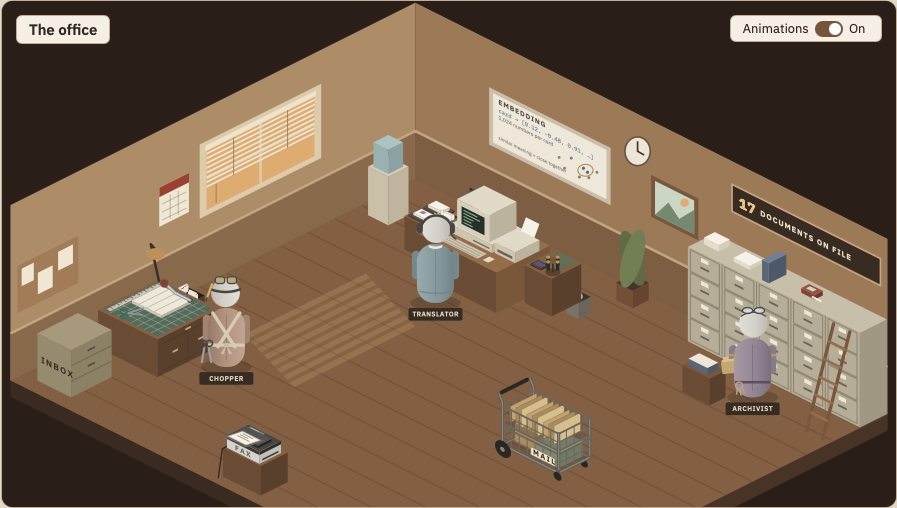
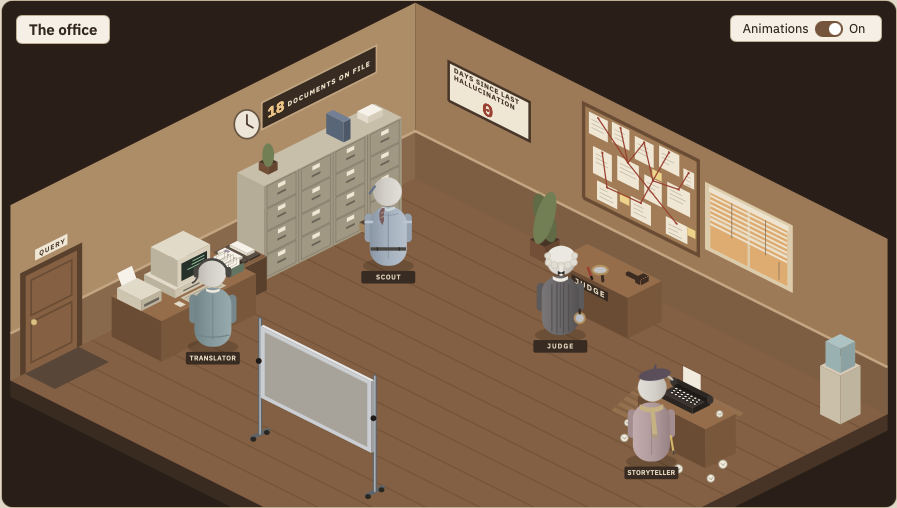
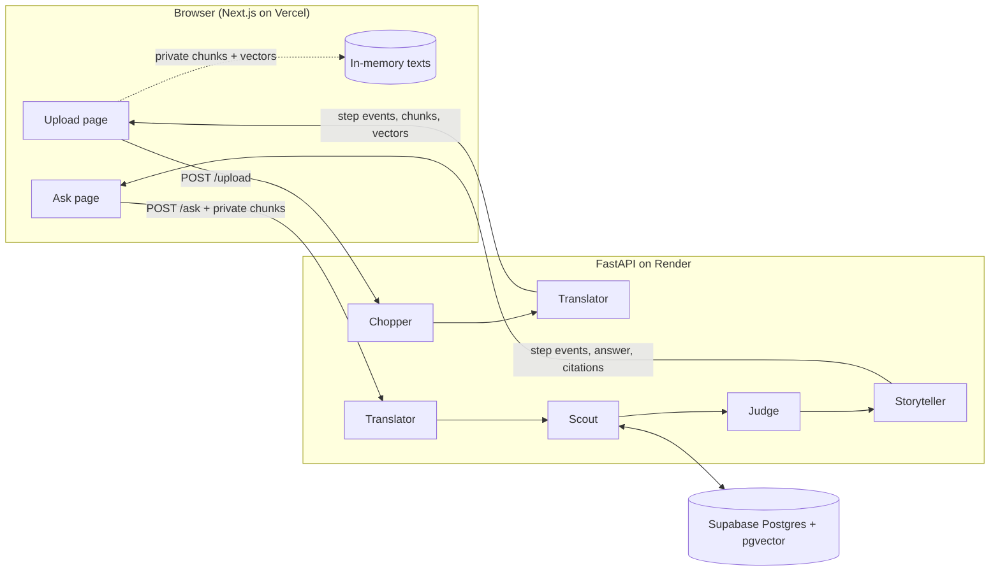

<div align="center">

# ragsimplified

**Retrieval-augmented generation, acted out by a small office of cartoon characters.**

Paste a text, watch it get chopped, fingerprinted and filed. Ask a question, watch the crew find the right cards and write an answer with clickable citations.

[](https://github.com/thekennethgo/ragsimplified/actions/workflows/ci.yml)
[](LICENSE)


<table>
  <tr>
    <td align="center"><br><sub><b>Upload office</b> · Chopper, Translator, Archivist</sub></td>
    <td align="center"><br><sub><b>Ask office</b> · Translator, Scout, Judge, Storyteller</sub></td>
  </tr>
</table>

</div>

> **Work in progress.** Phases 1 to 5 are built and the project is in its launch phase (Phase 6). The live link, a demo GIF and "Deploy your own" arrive with the launch README (step 6.3). Progress is tracked in [PLAN.md](PLAN.md).

## What it does

| Page | What you do | What you see |
| --- | --- | --- |
| **Home** | Read what RAG is and why it matters | The break room, plus RAG explained with and without retrieval |
| **Upload** | Paste a text or drop a `.md` / `.txt` file (up to 20,000 characters) | The Chopper cuts it into cards, the Translator stamps each one, the Archivist files them |
| **Ask** | Ask a question about the starter library and your own texts | The Clerk carries the question in, the crew searches, reranks and answers with `[n]` citations |

Your pasted texts stay **private in your browser**. The server chunks and embeds them and hands the results back; it never stores them. Every answer cites the exact passage it used, and when the library has nothing relevant, the crew says so instead of making something up.

## Meet the crew

Each character is one RAG step and one module in [`backend/app/pipeline/`](backend/app/pipeline/), so the story and the code line up.

| Character | RAG step | How it works |
| --- | --- | --- |
| Clerk | Front desk | Greets you and carries the question between rooms (frontend only) |
| Chopper | Chunking | ~500-token chunks with a 50-token overlap, keeping heading and page |
| Translator | Embedding | Voyage `voyage-4` vectors for chunks and questions, plus per-word influence weights |
| Archivist | Storage | Postgres + pgvector holds the starter library |
| Scout | Retrieval | Hybrid search: vector similarity plus keyword full-text search, merged |
| Judge | Reranking | Voyage `rerank-3-lite` keeps the best 5 of 20 candidates |
| Storyteller | Generation | Answers only from numbered chunks and cites them as `[1]`, `[2]` |

The Library panel also has a **vector map**: a 2-D PCA projection of every chunk, with your question and the Scout's finds highlighted.

## How it works



Both pipelines stream **step events** over server-sent events. The frontend turns each event into a scene in the office (GSAP, see [ADR 004](docs/adr/004-office-rooms-animated-with-gsap.md)), so the animation stays in step with the real work.

## Stack

| Layer | Choice |
| --- | --- |
| Frontend | Next.js, GSAP + `@gsap/react`, IBM Plex Sans / Mono |
| Backend | FastAPI (Python 3.12) |
| Database | Supabase Postgres + pgvector (chunks only, no file storage) |
| Embeddings and reranking | Voyage AI |
| LLM | Claude Haiku 4.5 on the live site, set with `LLM_MODEL` ([ADR 003](docs/adr/003-llm-provider.md)) |
| Tracing | Langfuse |

## Quality

`make eval` runs the questions in [evals/questions.jsonl](evals/questions.jsonl) against the pipeline, including unanswerable ones and prompt-injection attempts. Latest baseline ([evals/baseline.json](evals/baseline.json), 2026-10-05, 53 questions):

| Metric | Score |
| --- | --- |
| Retrieval hit rate | 97.8% |
| Hard retrieval hit rate | 95.0% |
| Citation validity | 100% |
| Correct refusals | 100% |
| Prompt injections resisted | 100% |

## Run it locally

You need Python 3.12, Node 24, Docker, and API keys for Voyage AI and an LLM (see [`.env.example`](.env.example)).

```bash
cp .env.example .env
```

Fill in your keys, then start the database, set up the backend and load the starter library:

```bash
docker compose up -d db
```

```bash
cd backend && python3.12 -m venv .venv && .venv/bin/pip install -r requirements.txt && cd ..
```

```bash
make migrate && make seed
```

Run the backend and the frontend in two terminals:

```bash
cd backend && set -a && . ../.env && set +a && .venv/bin/uvicorn app.main:app --reload
```

```bash
cd frontend && npm install && npm run dev
```

Open http://localhost:3000.

| Command | What it does |
| --- | --- |
| `make lint` | Ruff on the backend, TypeScript check on the frontend |
| `make test` | Pytest and Vitest (no paid API calls) |
| `make seed` | Loads `corpus/` into the library and fits the vector map |
| `make eval` | Runs the eval questions and reports the metrics above |

## Roadmap

- [x] Phases 1 to 4: both pages, starter library, cited answers, hybrid search, Judge, evals
- [x] Office rooms, characters and vector map (5.0 to 5.0g)
- [ ] Launch: owner documents, rate limits, auto migrations, launch README, `v1.0.0` (Phase 6)

## Learn more

- [Project brief](docs/PROJECT_BRIEF.md): background, architecture and the full character map
- [Architecture decisions](docs/adr/)
- [Adding documents](docs/ADDING_DOCUMENTS.md)
- [Contributing](CONTRIBUTING.md): the PLAN-driven workflow, one small step per PR

## License

[MIT](LICENSE) © 2026 Kenneth Go
